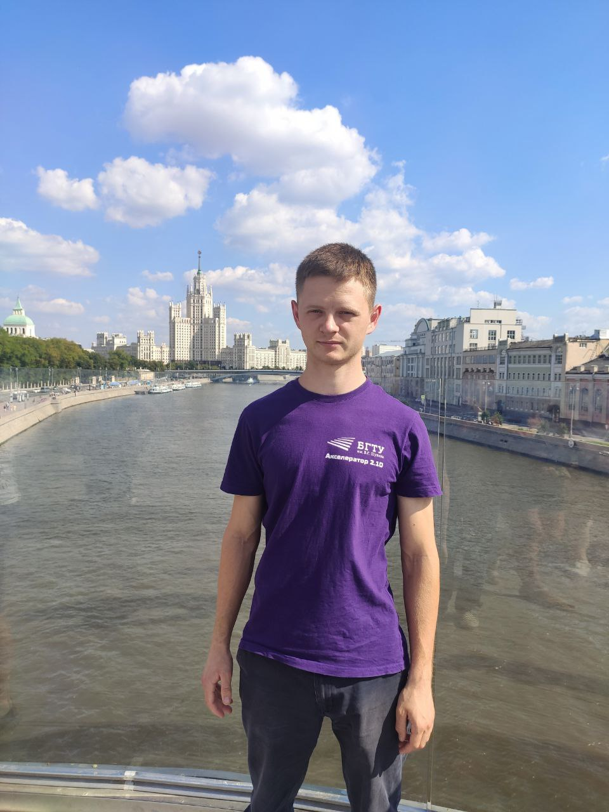

!!! info
    :man_construction_worker: This site is still in development. Some pages might be unfinished. We are working on this and will be happy to see you later.

About me
--------

Hello. I am Maksym Tanchuk and I do Electrical/Embedded Enineering.

It is me at Moscow.

As an embedded systems engineer I do calculations and modeling in MATLAB/Simulink. Based on modeling results I develop digital electronic devices using STM32 and ATMEL microcontrollers. You can look what exactly I do through [**my portfolio**](https://drive.google.com/file/d/1nb57aAj6b8ldJxEBDAUccIsqwLOzq9PD/view?usp=sharing "Portfolio").

My contacts and social media
----------------------------
:material-phone: Phone: [+49015158846487](tel:+49015158846487)

:material-email: Email: [tan4ukmak7@gmail.com](mailto:tan4ukmak7@gmail.com)

:fontawesome-brands-telegram: Telegram: [@TAN4UK](https://t.me/TAN4UK)

:fontawesome-brands-linkedin: [LinkedIn](https://www.linkedin.com/in/tan4uk)

:fontawesome-brands-github-alt: [GitHub](https://github.com/TAN4UKmax/)
